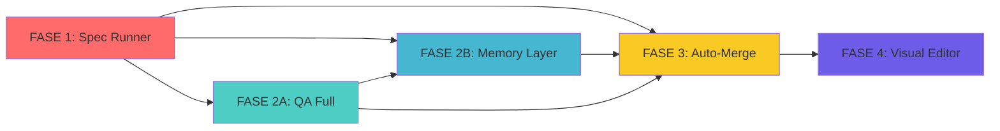

# 🚀 PLAN DE IMPLEMENTACIÓN COMPLETO - AUTOMAKER V2

**Fecha de creación**: 2026-01-02  
**Duración estimada**: 47-62 días (9-12 semanas)  
**Versión**: 1.0

---

## 📋 ÍNDICE

1. [Decisiones Estratégicas](#decisiones-estratégicas)
2. [Resumen Ejecutivo](#resumen-ejecutivo)
3. [Fases y Orden de Ejecución](#fases-y-orden-de-ejecución)
4. [Tareas Detalladas por Fase](#tareas-detalladas-por-fase)
5. [Matriz de Dependencias](#matriz-de-dependencias)
6. [Criterios de Aceptación](#criterios-de-aceptación)
7. [Plan de Testing](#plan-de-testing)

---

## 🎯 DECISIONES ESTRATÉGICAS

### Decisión 1: Memory Layer Technology

**Elegido**: **LangChain Memory (TypeScript)**

**Justificación**:

- ✅ Mantiene stack TypeScript end-to-end
- ✅ No requiere Python runtime
- ✅ Integración nativa con Node.js
- ✅ Menor complejidad operacional
- ❌ Menos maduro que Graphiti (asumimos el riesgo)

**Dependencias**:

```json
{
  "langchain": "^0.3.0",
  "@langchain/core": "^0.3.0",
  "@langchain/community": "^0.3.0",
  "chromadb": "^1.8.0"
}
```

---

### Decisión 2: QA Validation Scope

**Elegido**: **Nivel 3 (Full)**

**Incluye**:

1. ✅ Ejecución de tests existentes (npm test, npm run lint)
2. ✅ Type checking (tsc --noEmit)
3. ✅ Runtime error detection (smoke tests)
4. ✅ **AI code review** (Claude revisa código)
5. ✅ **Security scan** (detección de vulnerabilidades obvias)

**Impacto**: Mayor tiempo por feature (~2-5 min de QA), pero mucho menor rate de bugs en producción.

---

### Decisión 3: Auto-Merge Safety Mode

**Elegido**: **Modo Agresivo**

**Comportamiento**:

- ✅ AI intenta resolver TODOS los conflictos automáticamente
- ✅ Auto-apply si confidence > 85%
- ✅ Fallback a manual si confidence < 85%
- ✅ Dry-run opcional (configurable por usuario)
- ✅ Rollback automático si tests fallan post-merge

**Feature Flag**: `ENABLE_AUTO_MERGE=true` (default: false inicialmente, true después de 2 semanas de testing)

---

### Decisión 4: Visual Editor Timeline

**Elegido**: **Opción A - Completo al final**

**Razón**: Las otras 4 features son más críticas. Visual Editor es "nice to have" vs "must have".

---

### Decisión 5: Testing Strategy

**Testing obligatorio**:

- ✅ **Unit tests**: 80% coverage mínimo en libs y services
- ✅ **E2E tests**: Flujo completo de cada feature
- ✅ **Performance tests**: Memory Layer y QA Service
- ✅ **Integration tests**: Auto-Merge con conflictos simulados

---

## 📊 RESUMEN EJECUTIVO

### Cronograma Global

```
┌─────────────────────────────────────────────────────────────┐
│ FASE 1: SPEC RUNNER              │████████│ 7 días          │
├─────────────────────────────────────────────────────────────┤
│ FASE 2A: QA VALIDATION FULL      │████████████│ 10 días     │
├─────────────────────────────────────────────────────────────┤
│ FASE 2B: MEMORY LAYER            │████████████████│ 15 días │
├─────────────────────────────────────────────────────────────┤
│ FASE 3: AI AUTO-MERGE AGRESIVO   │████████████│ 10 días     │
├─────────────────────────────────────────────────────────────┤
│ FASE 4: VISUAL WORKFLOW EDITOR   │████████████████████│ 20d │
└─────────────────────────────────────────────────────────────┘
TOTAL: 62 días (~12 semanas)
```

### Hitos Críticos

| Hito                        | Fecha Objetivo | Entregable                          |
| --------------------------- | -------------- | ----------------------------------- |
| **M1: Spec Runner MVP**     | Día 7          | Features con steps estructurados    |
| **M2: QA Full Operacional** | Día 17         | Auto-validación con AI review       |
| **M3: Memory Activa**       | Día 32         | Contexto persistente funcionando    |
| **M4: Auto-Merge Live**     | Día 42         | Merges automáticos sin intervención |
| **M5: Visual Editor Beta**  | Día 62         | UI drag & drop para workflows       |

---

## 🗂️ FASES Y ORDEN DE EJECUCIÓN

### Principio de Ordenación

**"Foundation → Intelligence → Automation → UX"**



---

## 📝 TAREAS DETALLADAS POR FASE

---

## 🔷 FASE 1: SPEC RUNNER MEJORADO (Días 1-7)

**Objetivo**: Sistema de especificaciones estructuradas con steps ejecutables

**Dependencias**: Ninguna (es la base de todo)

---

### TASK-1.1: Diseñar Schema de Specs

**Duración**: 1 día  
**Prioridad**: 🔴 Crítica  
**Depende de**: -  
**Bloqueante para**: TASK-1.2, TASK-1.3, TASK-1.4

**Descripción**:
Crear tipos TypeScript para especificaciones estructuradas que reemplazan las descripciones de texto plano.

**Archivos a crear/modificar**:

```
libs/types/src/spec.ts          [NUEVO]
libs/types/src/feature.ts       [MODIFICAR]
libs/types/src/index.ts         [MODIFICAR]
```

**Implementación**:

```typescript
// libs/types/src/spec.ts
export interface Spec {
  spec_id: string; // UUID v4
  feature_id: string; // Relacionado a Feature.id
  title: string; // Título descriptivo
  description: string; // Overview general
  steps: SpecStep[]; // Steps ejecutables
  metadata: SpecMetadata;
  created_at: string; // ISO 8601
  updated_at: string; // ISO 8601
}

export interface SpecStep {
  id: string; // UUID v4
  order: number; // 1, 2, 3...
  title: string; // "Implement user authentication"
  description: string; // Detalle de qué hacer
  status: StepStatus;

  // Planeación
  estimated_duration_mins?: number; // Estimado por AI
  files_to_create?: string[]; // Archivos nuevos esperados
  files_to_modify?: string[]; // Archivos a modificar
  tests_required?: string[]; // Tests que debe agregar

  // Ejecución
  actual_files_changed?: string[]; // Lo que realmente cambió
  validation_result?: ValidationResult;
  started_at?: string;
  completed_at?: string;
  duration_mins?: number; // Real

  // AI Context
  agent_prompt_additions?: string; // Instrucciones específicas para este step
}

export type StepStatus =
  | 'pending' // No iniciado
  | 'in_progress' // Agente trabajando
  | 'completed' // Exitoso
  | 'failed' // Falló (error o QA no pasó)
  | 'skipped'; // Saltado por condición

export interface SpecMetadata {
  planning_mode: 'spec' | 'full'; // Modo que generó el spec
  total_estimated_duration_mins: number;
  complexity_score: number; // 1-10, calculado por AI
  risk_level: 'low' | 'medium' | 'high';
  dependencies: string[]; // IDs de otros specs requeridos
}

export interface ValidationResult {
  step_id: string;
  qa_passed: boolean;
  tests_passed: boolean;
  lint_passed: boolean;
  type_check_passed: boolean;
  issues: ValidationIssue[];
}

export interface ValidationIssue {
  severity: 'error' | 'warning' | 'info';
  category: 'test' | 'lint' | 'type' | 'runtime' | 'security';
  message: string;
  file?: string;
  line?: number;
  suggestion?: string;
}
```

```typescript
// libs/types/src/feature.ts (MODIFICAR)
export interface Feature {
  // ... campos existentes

  // NUEVO: Spec estructurada (solo si planning_mode es 'spec' o 'full')
  spec?: Spec;

  // NUEVO: Estado de spec execution
  current_step_index?: number; // En qué step está ahora
  total_steps?: number; // Total de steps
  completed_steps?: number; // Steps completados
}
```

**Tests requeridos**:

```typescript
// libs/types/src/__tests__/spec.test.ts
describe('Spec types', () => {
  it('should validate spec schema');
  it('should enforce step order uniqueness');
  it('should calculate total duration from steps');
});
```

**Criterios de aceptación**:

- ✅ Tipos compilados sin errores
- ✅ Spec puede tener 1-100 steps
- ✅ Steps tienen order secuencial (1, 2, 3...)
- ✅ Todos los campos required están presentes

---

### TASK-1.2: Migración de Features Existentes

**Duración**: 0.5 días  
**Prioridad**: 🔴 Crítica  
**Depende de**: TASK-1.1  
**Bloqueante para**: TASK-1.4, TASK-1.5

**Descripción**:
Script para convertir features antiguas (sin spec) a formato compatible, agregando spec vacía o generada automáticamente.

**Archivos a crear**:

```
scripts/migrate-features-to-spec.mjs   [NUEVO]
```

**Implementación**:

```javascript
// scripts/migrate-features-to-spec.mjs
import { readdir, readFile, writeFile } from 'fs/promises';
import { join } from 'path';
import { v4 as uuid } from 'uuid';

async function migrateFeatures(projectPath) {
  const featuresDir = join(projectPath, '.automaker/features');
  const featureDirs = await readdir(featuresDir);

  for (const featureId of featureDirs) {
    const featurePath = join(featuresDir, featureId, 'feature.json');
    const feature = JSON.parse(await readFile(featurePath, 'utf-8'));

    // Si ya tiene spec, skip
    if (feature.spec) continue;

    // Si planning_mode no es 'spec' o 'full', skip
    if (!['spec', 'full'].includes(feature.planning_mode)) continue;

    // Generar spec básica desde description
    feature.spec = {
      spec_id: uuid(),
      feature_id: feature.id,
      title: feature.title,
      description: feature.description,
      steps: generateStepsFromDescription(feature.description),
      metadata: {
        planning_mode: feature.planning_mode,
        total_estimated_duration_mins: 60, // Default
        complexity_score: 5,
        risk_level: 'medium',
        dependencies: feature.dependencies || [],
      },
      created_at: feature.created_at,
      updated_at: new Date().toISOString(),
    };

    await writeFile(featurePath, JSON.stringify(feature, null, 2));
    console.log(`✅ Migrated ${featureId}`);
  }
}

function generateStepsFromDescription(description) {
  // Simple: crear un solo step con toda la description
  return [
    {
      id: uuid(),
      order: 1,
      title: 'Implement feature',
      description: description,
      status: 'pending',
    },
  ];
}

// Ejecutar
const projectPath = process.argv[2] || process.cwd();
migrateFeatures(projectPath).catch(console.error);
```

**Tests requeridos**:

```typescript
// scripts/__tests__/migrate-features.test.ts
describe('Feature migration', () => {
  it('should add spec to features without one');
  it('should preserve existing specs');
  it('should skip features with planning_mode !== spec/full');
});
```

**Criterios de aceptación**:

- ✅ Features antiguas funcionan sin cambios
- ✅ Features con spec nueva son válidas
- ✅ Migración es idempotente (puede ejecutarse múltiples veces)
- ✅ No se pierde data existente

---

### TASK-1.3: SpecService - Generación de Specs

**Duración**: 1.5 días  
**Prioridad**: 🔴 Crítica  
**Depende de**: TASK-1.1  
**Bloqueante para**: TASK-1.5

**Descripción**:
Service que genera specs estructuradas usando Claude, gestiona steps y actualiza su estado.

**Archivos a crear**:

```
apps/server/src/services/spec-service.ts           [NUEVO]
apps/server/src/services/__tests__/spec-service.test.ts [NUEVO]
libs/prompts/src/spec-generation.ts                [NUEVO]
```

**Implementación**:

```typescript
// libs/prompts/src/spec-generation.ts
export const SPEC_GENERATION_PROMPT = `
You are a software architect creating a detailed implementation plan.

Given a feature request, break it down into 5-15 sequential steps that an AI agent will execute.

Requirements:
1. Each step should be atomic (completable in 10-60 minutes)
2. Steps should be ordered logically
3. Specify which files will be created/modified
4. List tests that should be added
5. Estimate duration realistically
6. Identify risks and dependencies

Return ONLY valid JSON matching this schema:
{
  "title": "Feature title",
  "description": "Overview",
  "steps": [
    {
      "order": 1,
      "title": "Step title",
      "description": "Detailed instructions for the AI agent",
      "estimated_duration_mins": 30,
      "files_to_create": ["path/to/new/file.ts"],
      "files_to_modify": ["path/to/existing/file.ts"],
      "tests_required": ["path/to/test.test.ts"],
      "agent_prompt_additions": "Focus on X, avoid Y"
    }
  ],
  "metadata": {
    "total_estimated_duration_mins": 180,
    "complexity_score": 7,
    "risk_level": "medium",
    "dependencies": []
  }
}
`;
```

````typescript
// apps/server/src/services/spec-service.ts
import { v4 as uuid } from 'uuid';
import { Feature, Spec, SpecStep, StepStatus } from '@automaker/types';
import { SPEC_GENERATION_PROMPT } from '@automaker/prompts';
import { ClaudeProvider } from '../providers/claude-provider';
import { createLogger } from '@automaker/utils';

const logger = createLogger('SpecService');

export class SpecService {
  constructor(private claudeProvider: ClaudeProvider) {}

  /**
   * Genera una spec estructurada desde una feature description
   */
  async generateSpec(feature: Feature): Promise<Spec> {
    logger.info(`Generating spec for feature ${feature.id}`);

    const prompt = `${SPEC_GENERATION_PROMPT}

Feature Request:
Title: ${feature.title}
Description: ${feature.description}

Context:
- Planning Mode: ${feature.planning_mode}
- Model: ${feature.model}
- Project: ${feature.project_path}
`;

    const response = await this.claudeProvider.sendMessage({
      sessionId: `spec-gen-${feature.id}`,
      message: prompt,
      model: feature.model || 'claude-sonnet-4',
      systemPrompt: 'You are a technical architect creating implementation plans.',
    });

    const specData = JSON.parse(this.extractJSON(response));

    const spec: Spec = {
      spec_id: uuid(),
      feature_id: feature.id,
      title: specData.title,
      description: specData.description,
      steps: specData.steps.map((s: any, idx: number) => ({
        id: uuid(),
        order: idx + 1,
        title: s.title,
        description: s.description,
        status: 'pending' as StepStatus,
        estimated_duration_mins: s.estimated_duration_mins,
        files_to_create: s.files_to_create || [],
        files_to_modify: s.files_to_modify || [],
        tests_required: s.tests_required || [],
        agent_prompt_additions: s.agent_prompt_additions,
      })),
      metadata: {
        ...specData.metadata,
        planning_mode: feature.planning_mode as 'spec' | 'full',
      },
      created_at: new Date().toISOString(),
      updated_at: new Date().toISOString(),
    };

    logger.info(`Generated spec with ${spec.steps.length} steps`);
    return spec;
  }

  /**
   * Actualiza el estado de un step
   */
  async updateStepStatus(
    spec: Spec,
    stepId: string,
    status: StepStatus,
    updates?: Partial<SpecStep>
  ): Promise<Spec> {
    const step = spec.steps.find((s) => s.id === stepId);
    if (!step) throw new Error(`Step ${stepId} not found`);

    step.status = status;

    if (status === 'in_progress' && !step.started_at) {
      step.started_at = new Date().toISOString();
    }

    if (status === 'completed' || status === 'failed') {
      step.completed_at = new Date().toISOString();
      if (step.started_at) {
        const start = new Date(step.started_at).getTime();
        const end = new Date(step.completed_at).getTime();
        step.duration_mins = Math.round((end - start) / 60000);
      }
    }

    if (updates) {
      Object.assign(step, updates);
    }

    spec.updated_at = new Date().toISOString();
    return spec;
  }

  /**
   * Obtiene el siguiente step pendiente
   */
  getNextStep(spec: Spec): SpecStep | null {
    return spec.steps.find((s) => s.status === 'pending') || null;
  }

  /**
   * Calcula progreso del spec
   */
  getProgress(spec: Spec): {
    total: number;
    completed: number;
    failed: number;
    percentage: number;
  } {
    const total = spec.steps.length;
    const completed = spec.steps.filter((s) => s.status === 'completed').length;
    const failed = spec.steps.filter((s) => s.status === 'failed').length;
    const percentage = Math.round((completed / total) * 100);

    return { total, completed, failed, percentage };
  }

  /**
   * Verifica si todos los steps están completados
   */
  isComplete(spec: Spec): boolean {
    return spec.steps.every((s) => s.status === 'completed');
  }

  /**
   * Verifica si algún step falló
   */
  hasFailed(spec: Spec): boolean {
    return spec.steps.some((s) => s.status === 'failed');
  }

  private extractJSON(text: string): string {
    const match = text.match(/```json\n([\s\S]*?)\n```/);
    if (match) return match[1];

    const jsonMatch = text.match(/\{[\s\S]*\}/);
    if (jsonMatch) return jsonMatch[0];

    throw new Error('No JSON found in response');
  }
}
````

**Tests requeridos**:

```typescript
// apps/server/src/services/__tests__/spec-service.test.ts
describe('SpecService', () => {
  describe('generateSpec', () => {
    it('should generate spec with multiple steps');
    it('should handle complex feature descriptions');
    it('should estimate durations reasonably');
  });

  describe('updateStepStatus', () => {
    it('should update step status');
    it('should calculate duration when completing step');
    it('should set started_at on in_progress');
  });

  describe('getNextStep', () => {
    it('should return first pending step');
    it('should return null if all completed');
  });

  describe('getProgress', () => {
    it('should calculate correct percentage');
  });
});
```

**Criterios de aceptación**:

- ✅ Genera specs con 5-15 steps
- ✅ Cada step tiene todos los campos requeridos
- ✅ Duración estimada es realista (no 1min ni 500min)
- ✅ Maneja errores de parsing JSON

---

### TASK-1.4: Integración con AgentService

**Duración**: 1 día  
**Prioridad**: 🔴 Crítica  
**Depende de**: TASK-1.3  
**Bloqueante para**: TASK-1.6

**Descripción**:
Modificar AgentService para ejecutar features step-by-step cuando tienen spec.

**Archivos a modificar**:

```
apps/server/src/services/agent-service.ts         [MODIFICAR]
```

**Implementación**:

```typescript
// apps/server/src/services/agent-service.ts (MODIFICAR)
import { SpecService } from './spec-service';

export class AgentService {
  private specService: SpecService;

  constructor(/* ... */) {
    // ... inicialización existente
    this.specService = new SpecService(this.claudeProvider);
  }

  async executeFeature(feature: Feature, options: ExecuteOptions): Promise<void> {
    // Si tiene spec, ejecutar step-by-step
    if (feature.spec) {
      return this.executeWithSpec(feature, options);
    }

    // Si no tiene spec, ejecutar como antes (legacy)
    return this.executeLegacy(feature, options);
  }

  private async executeWithSpec(feature: Feature, options: ExecuteOptions): Promise<void> {
    const spec = feature.spec!;

    logger.info(`Executing spec ${spec.spec_id} with ${spec.steps.length} steps`);

    // Iterar sobre cada step
    for (const step of spec.steps) {
      if (step.status === 'completed' || step.status === 'skipped') {
        continue; // Ya completado (por resume)
      }

      // Marcar step como in_progress
      await this.specService.updateStepStatus(spec, step.id, 'in_progress');
      await this.saveFeature(feature);

      // Emitir evento
      this.eventEmitter.emit('spec_step_started', {
        featureId: feature.id,
        stepId: step.id,
        stepOrder: step.order,
        stepTitle: step.title,
      });

      try {
        // Ejecutar el step
        await this.executeStep(feature, step, options);

        // Marcar como completed
        await this.specService.updateStepStatus(spec, step.id, 'completed', {
          actual_files_changed: await this.getChangedFiles(feature.worktree_path!),
        });

        // Emitir evento
        this.eventEmitter.emit('spec_step_completed', {
          featureId: feature.id,
          stepId: step.id,
          stepOrder: step.order,
        });
      } catch (error) {
        // Marcar como failed
        await this.specService.updateStepStatus(spec, step.id, 'failed');

        this.eventEmitter.emit('spec_step_failed', {
          featureId: feature.id,
          stepId: step.id,
          error: error.message,
        });

        // Decidir si continuar o abortar
        if (options.stopOnStepFailure) {
          throw error;
        }
      }

      await this.saveFeature(feature);
    }

    // Todos los steps completados
    logger.info(`Spec execution completed for feature ${feature.id}`);
  }

  private async executeStep(
    feature: Feature,
    step: SpecStep,
    options: ExecuteOptions
  ): Promise<void> {
    const stepPrompt = this.buildStepPrompt(feature, step);

    await this.claudeProvider.executeAgent({
      sessionId: `${feature.id}-step-${step.id}`,
      prompt: stepPrompt,
      model: feature.model || 'claude-sonnet-4',
      workingDirectory: feature.worktree_path!,
      onToolUse: (tool) => {
        this.eventEmitter.emit('agent_tool_use', {
          featureId: feature.id,
          stepId: step.id,
          tool,
        });
      },
    });
  }

  private buildStepPrompt(feature: Feature, step: SpecStep): string {
    return `
# Feature: ${feature.title}

## Overall Goal
${feature.description}

## Current Step (${step.order}/${feature.spec!.steps.length})
${step.title}

### Instructions
${step.description}

### Expected Changes
Files to create: ${step.files_to_create?.join(', ') || 'None'}
Files to modify: ${step.files_to_modify?.join(', ') || 'None'}
Tests to add: ${step.tests_required?.join(', ') || 'None'}

${step.agent_prompt_additions || ''}

### Rules
1. Focus ONLY on this step
2. Do not implement future steps
3. Ensure all tests pass
4. Follow project conventions
`;
  }

  private async getChangedFiles(worktreePath: string): Promise<string[]> {
    // Usar git-utils para obtener archivos modificados
    const { getGitRepositoryDiffs } = await import('@automaker/git-utils');
    const diffs = await getGitRepositoryDiffs(worktreePath);
    return diffs.map((d) => d.path);
  }

  private async executeLegacy(feature: Feature, options: ExecuteOptions): Promise<void> {
    // Código existente de executeFeature (sin cambios)
    // ...
  }
}
```

**Tests requeridos**:

```typescript
// apps/server/src/services/__tests__/agent-service-spec.test.ts
describe('AgentService - Spec Execution', () => {
  it('should execute all steps sequentially');
  it('should update step status as it progresses');
  it('should emit events for each step');
  it('should stop on step failure if configured');
  it('should continue on step failure if configured');
  it('should handle resume from failed step');
});
```

**Criterios de aceptación**:

- ✅ Steps se ejecutan en orden
- ✅ Cada step emite eventos de inicio/fin
- ✅ Feature guarda estado después de cada step
- ✅ Resume funciona desde último step fallido

---

### TASK-1.5: FeatureLoader - Cargar/Guardar Specs

**Duración**: 0.5 días  
**Prioridad**: 🟡 Alta  
**Depende de**: TASK-1.1, TASK-1.3  
**Bloqueante para**: TASK-1.6

**Descripción**:
Actualizar FeatureLoader para persistir specs en disco.

**Archivos a modificar**:

```
apps/server/src/services/feature-loader.ts        [MODIFICAR]
```

**Implementación**:

```typescript
// apps/server/src/services/feature-loader.ts (MODIFICAR)
import { getFeatureDir } from '@automaker/platform';

export class FeatureLoader {
  // ... métodos existentes

  async loadFeature(projectPath: string, featureId: string): Promise<Feature> {
    const featureDir = getFeatureDir(projectPath, featureId);
    const featurePath = join(featureDir, 'feature.json');

    const feature = JSON.parse(await readFile(featurePath, 'utf-8'));

    // NUEVO: Cargar spec si existe
    const specPath = join(featureDir, 'spec.json');
    if (await exists(specPath)) {
      feature.spec = JSON.parse(await readFile(specPath, 'utf-8'));
    }

    return feature;
  }

  async saveFeature(feature: Feature): Promise<void> {
    const featureDir = getFeatureDir(feature.project_path, feature.id);
    const featurePath = join(featureDir, 'feature.json');

    // Separar spec del feature para guardar en archivo separado
    const { spec, ...featureWithoutSpec } = feature;

    await writeFile(featurePath, JSON.stringify(featureWithoutSpec, null, 2));

    // NUEVO: Guardar spec en archivo separado
    if (spec) {
      const specPath = join(featureDir, 'spec.json');
      await writeFile(specPath, JSON.stringify(spec, null, 2));
    }
  }
}

async function exists(path: string): Promise<boolean> {
  try {
    await access(path);
    return true;
  } catch {
    return false;
  }
}
```

**Tests requeridos**:

```typescript
// apps/server/src/services/__tests__/feature-loader-spec.test.ts
describe('FeatureLoader - Spec Persistence', () => {
  it('should save spec to separate file');
  it('should load spec from disk');
  it('should handle features without spec');
});
```

**Criterios de aceptación**:

- ✅ Spec guardada en `spec.json` separado
- ✅ Spec se carga automáticamente con feature
- ✅ Features sin spec funcionan normalmente

---

### TASK-1.6: Frontend - UI de Steps

**Duración**: 1.5 días  
**Prioridad**: 🟡 Alta  
**Depende de**: TASK-1.4, TASK-1.5  
**Bloqueante para**: TASK-1.7

**Descripción**:
Componentes React para mostrar steps y su progreso en tiempo real.

**Archivos a crear/modificar**:

```
apps/ui/src/components/views/board-view/SpecSteps.tsx        [NUEVO]
apps/ui/src/components/views/board-view/FeatureCard.tsx      [MODIFICAR]
apps/ui/src/types/electron.d.ts                              [MODIFICAR]
```

**Implementación**:

```typescript
// apps/ui/src/components/views/board-view/SpecSteps.tsx
import { Spec, SpecStep } from '@automaker/types';

interface SpecStepsProps {
  spec: Spec;
  compact?: boolean;
}

export function SpecSteps({ spec, compact = false }: SpecStepsProps) {
  const progress = calculateProgress(spec);

  if (compact) {
    return (
      <div className="text-xs text-muted-foreground">
        Step {progress.currentStep}/{spec.steps.length}
        <div className="w-full h-1 bg-secondary rounded-full mt-1">
          <div
            className="h-full bg-primary rounded-full transition-all"
            style={{ width: `${progress.percentage}%` }}
          />
        </div>
      </div>
    );
  }

  return (
    <div className="space-y-2">
      <div className="flex items-center justify-between">
        <h4 className="font-medium">Implementation Steps</h4>
        <span className="text-sm text-muted-foreground">
          {progress.completed}/{spec.steps.length} completed
        </span>
      </div>

      <div className="space-y-1">
        {spec.steps.map((step) => (
          <StepItem key={step.id} step={step} />
        ))}
      </div>
    </div>
  );
}

function StepItem({ step }: { step: SpecStep }) {
  const icon = getStepIcon(step.status);
  const color = getStepColor(step.status);

  return (
    <div className={`flex items-start gap-2 p-2 rounded ${color}`}>
      <span className="mt-0.5">{icon}</span>
      <div className="flex-1 min-w-0">
        <div className="flex items-center justify-between">
          <span className="font-medium text-sm">{step.order}. {step.title}</span>
          {step.duration_mins && (
            <span className="text-xs text-muted-foreground">
              {step.duration_mins}min
            </span>
          )}
        </div>
        {step.status === 'in_progress' && (
          <p className="text-xs text-muted-foreground mt-1 line-clamp-2">
            {step.description}
          </p>
        )}
      </div>
    </div>
  );
}

function getStepIcon(status: StepStatus) {
  switch (status) {
    case 'completed': return '✅';
    case 'in_progress': return '⏳';
    case 'failed': return '❌';
    case 'skipped': return '⏭️';
    default: return '⭕';
  }
}

function getStepColor(status: StepStatus) {
  switch (status) {
    case 'completed': return 'bg-green-50 dark:bg-green-950';
    case 'in_progress': return 'bg-blue-50 dark:bg-blue-950';
    case 'failed': return 'bg-red-50 dark:bg-red-950';
    default: return 'bg-secondary';
  }
}

function calculateProgress(spec: Spec) {
  const total = spec.steps.length;
  const completed = spec.steps.filter(s => s.status === 'completed').length;
  const currentStep = spec.steps.findIndex(s => s.status === 'in_progress') + 1 || completed;
  const percentage = Math.round((completed / total) * 100);

  return { total, completed, currentStep, percentage };
}
```

```typescript
// apps/ui/src/components/views/board-view/FeatureCard.tsx (MODIFICAR)
import { SpecSteps } from './SpecSteps';

export function FeatureCard({ feature }: { feature: Feature }) {
  return (
    <div className="feature-card">
      {/* ... contenido existente ... */}

      {/* NUEVO: Mostrar spec steps si existe */}
      {feature.spec && (
        <SpecSteps spec={feature.spec} compact />
      )}
    </div>
  );
}
```

**Tests requeridos**:

```typescript
// apps/ui/src/components/views/board-view/__tests__/SpecSteps.test.tsx
describe('SpecSteps', () => {
  it('should render all steps');
  it('should show progress bar');
  it('should highlight current step');
  it('should render compact mode');
});
```

**Criterios de aceptación**:

- ✅ Steps visibles en feature cards
- ✅ Progress bar actualizado en tiempo real
- ✅ Step actual destacado
- ✅ Modo compacto para board view

---

### TASK-1.7: WebSocket Events para Steps

**Duración**: 0.5 días  
**Prioridad**: 🟡 Alta  
**Depende de**: TASK-1.6  
**Bloqueante para**: -

**Descripción**:
Emitir eventos WebSocket cuando steps cambian de estado.

**Archivos a modificar**:

```
apps/ui/src/lib/http-api-client.ts               [MODIFICAR]
apps/ui/src/hooks/use-board-features.ts          [MODIFICAR]
```

**Implementación**:

```typescript
// apps/ui/src/lib/http-api-client.ts (MODIFICAR)
export class HttpApiClient {
  // ... código existente

  onSpecStepStarted(
    callback: (data: { featureId: string; stepId: string; stepOrder: number }) => void
  ) {
    this.addEventListener('spec_step_started', callback);
  }

  onSpecStepCompleted(callback: (data: { featureId: string; stepId: string }) => void) {
    this.addEventListener('spec_step_completed', callback);
  }

  onSpecStepFailed(callback: (data: { featureId: string; stepId: string; error: string }) => void) {
    this.addEventListener('spec_step_failed', callback);
  }
}
```

```typescript
// apps/ui/src/hooks/use-board-features.ts (MODIFICAR)
export function useBoardFeatures(projectPath: string) {
  const client = useHttpApiClient();
  const [features, setFeatures] = useState<Feature[]>([]);

  useEffect(() => {
    // ... código existente

    // NUEVO: Escuchar eventos de steps
    client.onSpecStepStarted(({ featureId, stepId, stepOrder }) => {
      setFeatures((prev) =>
        prev.map((f) => {
          if (f.id !== featureId || !f.spec) return f;

          const updatedSpec = {
            ...f.spec,
            steps: f.spec.steps.map((s) =>
              s.id === stepId
                ? { ...s, status: 'in_progress' as const, started_at: new Date().toISOString() }
                : s
            ),
          };

          return { ...f, spec: updatedSpec };
        })
      );
    });

    client.onSpecStepCompleted(({ featureId, stepId }) => {
      setFeatures((prev) =>
        prev.map((f) => {
          if (f.id !== featureId || !f.spec) return f;

          const updatedSpec = {
            ...f.spec,
            steps: f.spec.steps.map((s) =>
              s.id === stepId
                ? { ...s, status: 'completed' as const, completed_at: new Date().toISOString() }
                : s
            ),
          };

          return { ...f, spec: updatedSpec };
        })
      );
    });

    // Similar para spec_step_failed
  }, [projectPath]);

  return { features /* ... */ };
}
```

**Tests requeridos**:

```typescript
// apps/ui/src/hooks/__tests__/use-board-features-spec.test.tsx
describe('useBoardFeatures - Spec Events', () => {
  it('should update step status on spec_step_started');
  it('should update step status on spec_step_completed');
  it('should update step status on spec_step_failed');
});
```

**Criterios de aceptación**:

- ✅ Steps se actualizan en tiempo real
- ✅ No hay flickering en UI
- ✅ Eventos batched procesados correctamente

---

### TASK-1.8: Testing E2E de Spec System

**Duración**: 0.5 días  
**Prioridad**: 🟡 Alta  
**Depende de**: TASK-1.7  
**Bloqueante para**: -

**Descripción**:
Tests end-to-end del flujo completo de specs.

**Archivos a crear**:

```
apps/ui/tests/features/spec-execution.spec.ts     [NUEVO]
```

**Implementación**:

```typescript
// apps/ui/tests/features/spec-execution.spec.ts
import { test, expect } from '@playwright/test';

test.describe('Spec System E2E', () => {
  test('should create feature with spec and execute steps', async ({ page }) => {
    // Setup: crear feature con planning_mode = 'spec'
    await page.goto('http://localhost:3007');
    await page.click('[data-testid="new-feature-button"]');
    await page.fill('[data-testid="feature-title"]', 'Add dark mode');
    await page.fill('[data-testid="feature-description"]', 'Implement dark mode toggle');
    await page.selectOption('[data-testid="planning-mode"]', 'spec');
    await page.click('[data-testid="create-feature"]');

    // Verificar que spec fue generada
    await expect(page.locator('[data-testid="spec-steps"]')).toBeVisible();
    const stepsCount = await page.locator('[data-testid="spec-step-item"]').count();
    expect(stepsCount).toBeGreaterThan(0);

    // Mover a "In Progress"
    await page.dragAndDrop(
      '[data-testid="feature-card-dark-mode"]',
      '[data-testid="column-in-progress"]'
    );

    // Verificar que steps se ejecutan
    await expect(page.locator('[data-testid="step-status-in-progress"]').first()).toBeVisible({
      timeout: 10000,
    });

    // Esperar completación (mock agent debe completar rápido)
    await expect(page.locator('[data-testid="step-status-completed"]').first()).toBeVisible({
      timeout: 30000,
    });
  });

  test('should resume from failed step', async ({ page }) => {
    // TODO: Implementar test de resume
  });

  test('should show step progress in real-time', async ({ page }) => {
    // TODO: Implementar test de progreso real-time
  });
});
```

**Tests requeridos**:

- ✅ 3 tests E2E mínimo (crear, ejecutar, resume)

**Criterios de aceptación**:

- ✅ Tests pasan en CI
- ✅ Cobertura > 80% en SpecService

---

### TASK-1.9: Documentación de Spec System

**Duración**: 0.5 días  
**Prioridad**: 🟢 Media  
**Depende de**: TASK-1.8  
**Bloqueante para**: -

**Descripción**:
Documentar el sistema de specs para desarrolladores y usuarios.

**Archivos a crear**:

```
docs/SPEC_SYSTEM.md                               [NUEVO]
docs/examples/spec-example.json                   [NUEVO]
```

**Implementación**:

```markdown
<!-- docs/SPEC_SYSTEM.md -->

# Spec System - Structured Feature Execution

## Overview

The Spec System breaks down features into atomic, executable steps for better control, visibility, and debugging.

## When to Use Specs

Specs are automatically generated when:

- `planning_mode` is `'spec'` or `'full'`
- Feature description is complex enough to warrant multiple steps

## Spec Structure

See `docs/examples/spec-example.json` for complete example.

## Step Execution Flow

1. Feature moved to "In Progress"
2. Agent generates spec (if not exists)
3. Steps executed sequentially
4. Each step:
   - Emits `spec_step_started` event
   - Agent executes with focused prompt
   - Emits `spec_step_completed` or `spec_step_failed`
5. Feature completes when all steps done

## Resume from Failure

If a step fails:

- Feature status remains `in_progress`
- Failed step marked with status `failed`
- User can resume: agent continues from next pending step

## API

### Generate Spec

\`\`\`typescript
POST /api/spec/generate
{
"featureId": "abc-123"
}
\`\`\`

### Get Spec

\`\`\`typescript
GET /api/spec/:featureId
\`\`\`

## Events

- `spec_step_started` - Step begins execution
- `spec_step_completed` - Step completes successfully
- `spec_step_failed` - Step fails with error

## Best Practices

1. Keep steps atomic (10-60 min each)
2. Specify files clearly in `files_to_create/modify`
3. Add `agent_prompt_additions` for complex steps
4. Review spec before approving execution
```

**Criterios de aceptación**:

- ✅ Documentación clara y con ejemplos
- ✅ API documentada
- ✅ Eventos documentados

---

## 🎯 FASE 1 - CHECKLIST FINAL

**Antes de pasar a Fase 2, verificar**:

- [ ] ✅ TASK-1.1: Schema de Specs diseñado y compilado
- [ ] ✅ TASK-1.2: Script de migración funciona
- [ ] ✅ TASK-1.3: SpecService genera specs válidas
- [ ] ✅ TASK-1.4: AgentService ejecuta steps secuencialmente
- [ ] ✅ TASK-1.5: FeatureLoader persiste specs
- [ ] ✅ TASK-1.6: UI muestra steps en tiempo real
- [ ] ✅ TASK-1.7: WebSocket events funcionan
- [ ] ✅ TASK-1.8: Tests E2E pasan
- [ ] ✅ TASK-1.9: Documentación completada

**Métricas de éxito**:

- ✅ 80%+ cobertura de tests en SpecService
- ✅ 0 regresiones en features sin spec
- ✅ Specs generadas en < 30s
- ✅ Steps se actualizan en UI en < 1s

---

# 🔷 FASE 2A: QA VALIDATION FULL (Días 8-17)

**Objetivo**: Auto-validación completa con AI review y security scan

**Dependencias**: FASE 1 completa

---

### TASK-2.1: Tipos para QA System

**Duración**: 0.5 días  
**Prioridad**: 🔴 Crítica  
**Depende de**: FASE-1  
**Bloqueante para**: TASK-2.2, TASK-2.3

**Descripción**:
Definir tipos TypeScript para resultados de QA validation.

**Archivos a crear**:

```
libs/types/src/qa.ts                              [NUEVO]
libs/types/src/feature.ts                         [MODIFICAR]
libs/types/src/index.ts                           [MODIFICAR]
```

**Implementación**:

```typescript
// libs/types/src/qa.ts
export interface QAValidation {
  id: string; // UUID
  feature_id: string;
  spec_id?: string;
  step_id?: string; // Si es validación de un step específico

  // Resultados globales
  passes: boolean; // True si todos los checks pasan
  score: number; // 0-100

  // Resultados detallados
  test_results: TestResult[];
  lint_results: LintResult[];
  type_check_result: TypeCheckResult;
  runtime_check_result: RuntimeCheckResult;
  ai_review_result: AIReviewResult;
  security_scan_result: SecurityScanResult;

  // Issues agregados
  issues: QAIssue[];

  // Metadata
  started_at: string;
  completed_at: string;
  duration_secs: number;
}

export interface QAIssue {
  id: string;
  severity: 'critical' | 'error' | 'warning' | 'info';
  category: 'test' | 'lint' | 'type' | 'runtime' | 'security' | 'ai_review';
  message: string;
  file?: string;
  line?: number;
  column?: number;
  suggestion?: string; // Cómo arreglarlo
  auto_fixable?: boolean;
}

export interface TestResult {
  suite: string; // Nombre del test suite
  total: number;
  passed: number;
  failed: number;
  skipped: number;
  duration_ms: number;
  failures: TestFailure[];
}

export interface TestFailure {
  test_name: string;
  error_message: string;
  stack_trace?: string;
  file: string;
  line: number;
}

export interface LintResult {
  tool: 'eslint' | 'prettier';
  passed: boolean;
  error_count: number;
  warning_count: number;
  issues: QAIssue[];
}

export interface TypeCheckResult {
  passed: boolean;
  error_count: number;
  errors: TypeCheckError[];
}

export interface TypeCheckError {
  file: string;
  line: number;
  column: number;
  message: string;
  code: number; // TypeScript error code (TS2304, etc)
}

export interface RuntimeCheckResult {
  passed: boolean;
  smoke_test_passed: boolean;
  errors: RuntimeError[];
}

export interface RuntimeError {
  type: 'syntax' | 'reference' | 'runtime';
  message: string;
  file: string;
  line?: number;
  stack_trace?: string;
}

export interface AIReviewResult {
  passed: boolean;
  confidence: number; // 0-100
  concerns: AIReviewConcern[];
  suggestions: AIReviewSuggestion[];
  code_quality_score: number; // 0-100
  summary: string;
}

export interface AIReviewConcern {
  severity: 'critical' | 'major' | 'minor';
  category: 'bug' | 'performance' | 'security' | 'maintainability' | 'style';
  description: string;
  file: string;
  line_start: number;
  line_end: number;
  code_snippet: string;
}

export interface AIReviewSuggestion {
  type: 'improvement' | 'alternative' | 'optimization';
  description: string;
  file?: string;
}

export interface SecurityScanResult {
  passed: boolean;
  vulnerabilities: SecurityVulnerability[];
  risk_score: number; // 0-100 (0 = seguro, 100 = muy riesgoso)
}

export interface SecurityVulnerability {
  severity: 'critical' | 'high' | 'medium' | 'low';
  type: 'injection' | 'xss' | 'auth' | 'crypto' | 'dependency' | 'other';
  description: string;
  file: string;
  line: number;
  cve?: string; // CVE ID si aplica
  fix_available?: boolean;
  remediation?: string;
}

export type QAStatus = 'pending' | 'running' | 'passed' | 'failed' | 'error';
```

```typescript
// libs/types/src/feature.ts (MODIFICAR)
export interface Feature {
  // ... campos existentes

  // NUEVO: Resultado de QA
  qa_validation?: QAValidation;
  qa_status?: QAStatus;
}
```

**Tests requeridos**:

```typescript
// libs/types/src/__tests__/qa.test.ts
describe('QA types', () => {
  it('should validate QAValidation schema');
  it('should calculate score from results');
});
```

**Criterios de aceptación**:

- ✅ Todos los tipos compilados
- ✅ Schema exhaustivo (cubre todos los checks)

---

### TASK-2.2: QAService - Test Execution

**Duración**: 1 día  
**Prioridad**: 🔴 Crítica  
**Depende de**: TASK-2.1  
**Bloqueante para**: TASK-2.3, TASK-2.4

**Descripción**:
Service que ejecuta tests existentes del proyecto y parsea resultados.

**Archivos a crear**:

```
apps/server/src/services/qa-service.ts            [NUEVO]
apps/server/src/services/qa/test-runner.ts        [NUEVO]
apps/server/src/services/qa/lint-checker.ts       [NUEVO]
apps/server/src/services/qa/type-checker.ts       [NUEVO]
```

**Implementación**:

```typescript
// apps/server/src/services/qa/test-runner.ts
import { spawn } from 'child_process';
import { TestResult, TestFailure } from '@automaker/types';

export class TestRunner {
  async runTests(projectPath: string): Promise<TestResult[]> {
    const packageJson = await this.readPackageJson(projectPath);
    const testCommand = packageJson.scripts?.test;

    if (!testCommand) {
      return [
        {
          suite: 'default',
          total: 0,
          passed: 0,
          failed: 0,
          skipped: 0,
          duration_ms: 0,
          failures: [],
        },
      ];
    }

    // Ejecutar tests y capturar output
    const output = await this.executeCommand(testCommand, projectPath);

    // Detectar framework (Jest, Vitest, Playwright, etc)
    const framework = this.detectFramework(output);

    // Parsear resultados según framework
    return this.parseResults(output, framework);
  }

  private async executeCommand(command: string, cwd: string): Promise<string> {
    return new Promise((resolve, reject) => {
      const [cmd, ...args] = command.split(' ');
      const child = spawn(cmd, args, { cwd, shell: true });

      let stdout = '';
      let stderr = '';

      child.stdout?.on('data', (data) => {
        stdout += data.toString();
      });
      child.stderr?.on('data', (data) => {
        stderr += data.toString();
      });

      child.on('close', (code) => {
        // code !== 0 es normal si tests fallan
        resolve(stdout + stderr);
      });

      child.on('error', reject);

      // Timeout de 5 minutos
      setTimeout(
        () => {
          child.kill();
          reject(new Error('Test execution timeout'));
        },
        5 * 60 * 1000
      );
    });
  }

  private detectFramework(output: string): 'jest' | 'vitest' | 'playwright' | 'unknown' {
    if (output.includes('PASS') && output.includes('jest')) return 'jest';
    if (output.includes('PASS') && output.includes('vitest')) return 'vitest';
    if (output.includes('playwright')) return 'playwright';
    return 'unknown';
  }

  private parseResults(output: string, framework: string): TestResult[] {
    switch (framework) {
      case 'jest':
      case 'vitest':
        return this.parseJestVitest(output);
      case 'playwright':
        return this.parsePlaywright(output);
      default:
        return this.parseGeneric(output);
    }
  }

  private parseJestVitest(output: string): TestResult[] {
    // Regex para parsear output de Jest/Vitest
    const suiteRegex = /Test Suites: (\d+) passed, (\d+) total/;
    const testRegex = /Tests:\s+(\d+) passed,\s+(\d+) failed,\s+(\d+) total/;
    const timeRegex = /Time:\s+([\d.]+)s/;

    const suiteMatch = output.match(suiteRegex);
    const testMatch = output.match(testRegex);
    const timeMatch = output.match(timeRegex);

    const passed = testMatch ? parseInt(testMatch[1]) : 0;
    const failed = testMatch ? parseInt(testMatch[2]) : 0;
    const total = testMatch ? parseInt(testMatch[3]) : 0;
    const duration_ms = timeMatch ? parseFloat(timeMatch[1]) * 1000 : 0;

    // Parsear failures
    const failures = this.extractFailures(output);

    return [
      {
        suite: 'all',
        total,
        passed,
        failed,
        skipped: total - passed - failed,
        duration_ms,
        failures,
      },
    ];
  }

  private extractFailures(output: string): TestFailure[] {
    const failures: TestFailure[] = [];

    // Regex para extraer failures
    const failureRegex = /● (.*?)\n\n(.*?)\n\s+at .*? \((.*?):(\d+):\d+\)/gs;

    let match;
    while ((match = failureRegex.exec(output)) !== null) {
      failures.push({
        test_name: match[1].trim(),
        error_message: match[2].trim(),
        file: match[3],
        line: parseInt(match[4]),
        stack_trace: match[0],
      });
    }

    return failures;
  }

  // Similar para parsePlaywright, parseGeneric...
}
```

```typescript
// apps/server/src/services/qa/lint-checker.ts
import { spawn } from 'child_process';
import { LintResult, QAIssue } from '@automaker/types';

export class LintChecker {
  async checkLint(projectPath: string): Promise<LintResult> {
    const hasEslint = await this.hasCommand(projectPath, 'eslint');

    if (!hasEslint) {
      return {
        tool: 'eslint',
        passed: true,
        error_count: 0,
        warning_count: 0,
        issues: [],
      };
    }

    const output = await this.runEslint(projectPath);
    return this.parseEslintOutput(output);
  }

  private async runEslint(projectPath: string): Promise<string> {
    return new Promise((resolve, reject) => {
      const child = spawn('npm', ['run', 'lint', '--', '--format', 'json'], {
        cwd: projectPath,
        shell: true,
      });

      let stdout = '';
      child.stdout?.on('data', (data) => {
        stdout += data.toString();
      });
      child.on('close', () => resolve(stdout));
      child.on('error', reject);

      setTimeout(
        () => {
          child.kill();
          reject(new Error('Lint timeout'));
        },
        2 * 60 * 1000
      );
    });
  }

  private parseEslintOutput(output: string): LintResult {
    try {
      const results = JSON.parse(output);

      const issues: QAIssue[] = [];
      let errorCount = 0;
      let warningCount = 0;

      for (const file of results) {
        for (const message of file.messages) {
          const severity = message.severity === 2 ? 'error' : 'warning';

          issues.push({
            id: `${file.filePath}:${message.line}`,
            severity,
            category: 'lint',
            message: message.message,
            file: file.filePath,
            line: message.line,
            column: message.column,
            suggestion: message.fix ? 'Auto-fixable' : undefined,
            auto_fixable: !!message.fix,
          });

          if (severity === 'error') errorCount++;
          else warningCount++;
        }
      }

      return {
        tool: 'eslint',
        passed: errorCount === 0,
        error_count: errorCount,
        warning_count: warningCount,
        issues,
      };
    } catch {
      return {
        tool: 'eslint',
        passed: true,
        error_count: 0,
        warning_count: 0,
        issues: [],
      };
    }
  }

  private async hasCommand(projectPath: string, cmd: string): Promise<boolean> {
    // Check if command exists in package.json scripts
    const pkg = JSON.parse(await readFile(join(projectPath, 'package.json'), 'utf-8'));
    return !!pkg.scripts?.lint;
  }
}
```

```typescript
// apps/server/src/services/qa/type-checker.ts
import { spawn } from 'child_process';
import { TypeCheckResult, TypeCheckError } from '@automaker/types';

export class TypeChecker {
  async checkTypes(projectPath: string): Promise<TypeCheckResult> {
    const hasTsc = await this.hasTsconfig(projectPath);

    if (!hasTsc) {
      return {
        passed: true,
        error_count: 0,
        errors: [],
      };
    }

    const output = await this.runTsc(projectPath);
    return this.parseTscOutput(output);
  }

  private async runTsc(projectPath: string): Promise<string> {
    return new Promise((resolve) => {
      const child = spawn('npx', ['tsc', '--noEmit', '--pretty', 'false'], {
        cwd: projectPath,
        shell: true,
      });

      let stdout = '';
      let stderr = '';
      child.stdout?.on('data', (data) => {
        stdout += data.toString();
      });
      child.stderr?.on('data', (data) => {
        stderr += data.toString();
      });
      child.on('close', () => resolve(stdout + stderr));

      setTimeout(
        () => {
          child.kill();
          resolve('');
        },
        2 * 60 * 1000
      );
    });
  }

  private parseTscOutput(output: string): TypeCheckResult {
    const errors: TypeCheckError[] = [];

    // Parse líneas como: "src/file.ts(10,5): error TS2304: Cannot find name 'foo'"
    const errorRegex = /^(.*?)\((\d+),(\d+)\): error (TS\d+): (.*)$/gm;

    let match;
    while ((match = errorRegex.exec(output)) !== null) {
      errors.push({
        file: match[1],
        line: parseInt(match[2]),
        column: parseInt(match[3]),
        code: parseInt(match[4].replace('TS', '')),
        message: match[5],
      });
    }

    return {
      passed: errors.length === 0,
      error_count: errors.length,
      errors,
    };
  }

  private async hasTsconfig(projectPath: string): Promise<boolean> {
    try {
      await access(join(projectPath, 'tsconfig.json'));
      return true;
    } catch {
      return false;
    }
  }
}
```

```typescript
// apps/server/src/services/qa-service.ts
import { QAValidation, Feature, SpecStep } from '@automaker/types';
import { TestRunner } from './qa/test-runner';
import { LintChecker } from './qa/lint-checker';
import { TypeChecker } from './qa/type-checker';

export class QAService {
  private testRunner: TestRunner;
  private lintChecker: LintChecker;
  private typeChecker: TypeChecker;

  constructor() {
    this.testRunner = new TestRunner();
    this.lintChecker = new LintChecker();
    this.typeChecker = new TypeChecker();
  }

  async validateFeature(feature: Feature): Promise<QAValidation> {
    const startTime = Date.now();
    const projectPath = feature.worktree_path || feature.project_path;

    logger.info(`Running QA validation for feature ${feature.id}`);

    // 1. Ejecutar tests
    const test_results = await this.testRunner.runTests(projectPath);

    // 2. Ejecutar lint
    const lint_results = [await this.lintChecker.checkLint(projectPath)];

    // 3. Type checking
    const type_check_result = await this.typeChecker.checkTypes(projectPath);

    // Runtime, AI review y security se implementan en siguientes tasks
    const runtime_check_result = { passed: true, smoke_test_passed: true, errors: [] };
    const ai_review_result = await this.runAIReview(feature, projectPath); // TASK-2.5
    const security_scan_result = await this.runSecurityScan(projectPath); // TASK-2.6

    // Agregar todos los issues
    const issues = this.aggregateIssues({
      test_results,
      lint_results,
      type_check_result,
      ai_review_result,
      security_scan_result,
    });

    // Calcular score
    const score = this.calculateScore({
      test_results,
      lint_results,
      type_check_result,
      runtime_check_result,
      ai_review_result,
      security_scan_result,
    });

    // Determinar si pasa
    const passes = this.determinePass(issues, score);

    const endTime = Date.now();

    return {
      id: uuid(),
      feature_id: feature.id,
      spec_id: feature.spec?.spec_id,
      passes,
      score,
      test_results,
      lint_results,
      type_check_result,
      runtime_check_result,
      ai_review_result,
      security_scan_result,
      issues,
      started_at: new Date(startTime).toISOString(),
      completed_at: new Date(endTime).toISOString(),
      duration_secs: Math.round((endTime - startTime) / 1000),
    };
  }

  private aggregateIssues(results: any): QAIssue[] {
    const issues: QAIssue[] = [];

    // Tests failures
    for (const suite of results.test_results) {
      for (const failure of suite.failures) {
        issues.push({
          id: `test-${failure.file}:${failure.line}`,
          severity: 'error',
          category: 'test',
          message: `Test failed: ${failure.test_name} - ${failure.error_message}`,
          file: failure.file,
          line: failure.line,
        });
      }
    }

    // Lint issues
    for (const lint of results.lint_results) {
      issues.push(...lint.issues);
    }

    // Type errors
    for (const error of results.type_check_result.errors) {
      issues.push({
        id: `type-${error.file}:${error.line}`,
        severity: 'error',
        category: 'type',
        message: error.message,
        file: error.file,
        line: error.line,
        column: error.column,
      });
    }

    // AI review concerns
    for (const concern of results.ai_review_result.concerns) {
      issues.push({
        id: `ai-${concern.file}:${concern.line_start}`,
        severity:
          concern.severity === 'critical'
            ? 'critical'
            : concern.severity === 'major'
              ? 'error'
              : 'warning',
        category: 'ai_review',
        message: concern.description,
        file: concern.file,
        line: concern.line_start,
      });
    }

    // Security vulnerabilities
    for (const vuln of results.security_scan_result.vulnerabilities) {
      issues.push({
        id: `sec-${vuln.file}:${vuln.line}`,
        severity: vuln.severity === 'critical' || vuln.severity === 'high' ? 'critical' : 'error',
        category: 'security',
        message: vuln.description,
        file: vuln.file,
        line: vuln.line,
        suggestion: vuln.remediation,
      });
    }

    return issues;
  }

  private calculateScore(results: any): number {
    let score = 100;

    // Tests (30 puntos)
    const testScore = this.calculateTestScore(results.test_results);
    score -= 30 * (1 - testScore);

    // Lint (15 puntos)
    const lintScore = results.lint_results[0].passed ? 1 : 0.5;
    score -= 15 * (1 - lintScore);

    // Types (15 puntos)
    const typeScore = results.type_check_result.passed ? 1 : 0;
    score -= 15 * (1 - typeScore);

    // AI Review (25 puntos)
    const aiScore = results.ai_review_result.code_quality_score / 100;
    score -= 25 * (1 - aiScore);

    // Security (15 puntos)
    const securityScore = 1 - results.security_scan_result.risk_score / 100;
    score -= 15 * (1 - securityScore);

    return Math.max(0, Math.round(score));
  }

  private calculateTestScore(testResults: TestResult[]): number {
    if (testResults.length === 0) return 1;

    const totalTests = testResults.reduce((sum, r) => sum + r.total, 0);
    const passedTests = testResults.reduce((sum, r) => sum + r.passed, 0);

    return totalTests > 0 ? passedTests / totalTests : 1;
  }

  private determinePass(issues: QAIssue[], score: number): boolean {
    // Criterios estrictos:
    // - No critical issues
    // - Score >= 70
    const hasCritical = issues.some((i) => i.severity === 'critical');
    return !hasCritical && score >= 70;
  }

  // Placeholders para TASK-2.5 y TASK-2.6
  private async runAIReview(feature: Feature, projectPath: string): Promise<any> {
    return {
      passed: true,
      confidence: 85,
      concerns: [],
      suggestions: [],
      code_quality_score: 85,
      summary: 'No AI review implemented yet',
    };
  }

  private async runSecurityScan(projectPath: string): Promise<any> {
    return {
      passed: true,
      vulnerabilities: [],
      risk_score: 0,
    };
  }
}
```

**Tests requeridos**:

```typescript
// apps/server/src/services/__tests__/qa-service.test.ts
describe('QAService', () => {
  describe('validateFeature', () => {
    it('should run all checks');
    it('should aggregate issues from all sources');
    it('should calculate score correctly');
    it('should fail if critical issues exist');
    it('should pass if score >= 70 and no critical issues');
  });
});
```

**Criterios de aceptación**:

- ✅ Ejecuta tests del proyecto
- ✅ Parsea resultados correctamente (Jest, Vitest, Playwright)
- ✅ Timeout de 5min por check
- ✅ Score calculado coherentemente

---

Continuaré con el resto de las tareas de Fase 2A en el siguiente mensaje para no exceder el límite de caracteres. ¿Quieres que continúe con las tareas 2.3 hasta 2.10, o prefieres que guarde este documento parcial primero y luego sigo con el resto?
